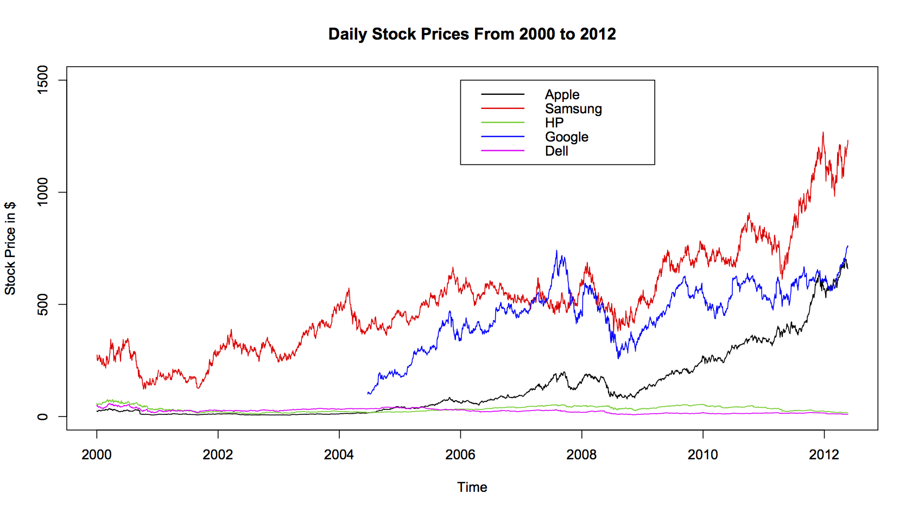
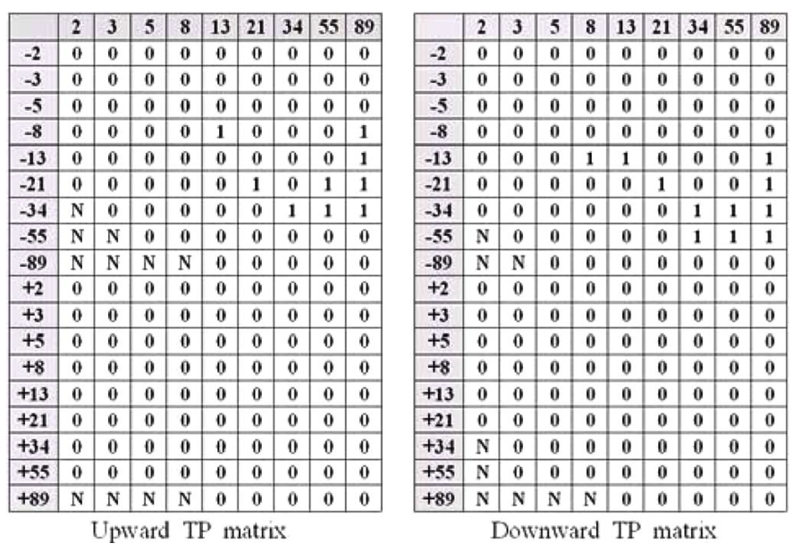

# Stock Price Prediction

A machine learning project that predicts sotck price in the future.  
It's a course project of CSIT 600D Introduction to Big Data, HKUST, 2017.

## Prerequisites
- Python 3.3+
- [Tensorflow 0.12.1](https://github.com/tensorflow/tensorflow/tree/r0.12)
- [Zipline](https://github.com/quantopian/zipline)

## Machine learning part

In brief, this a regression problem(supervised learning) in machine learing.

### Input

Raw data is preprocessed as TP Matrix format.

### Model

Convolutional Neural Networks is used to fit the labeled data.

### Output

The CNNs gives a predicted stock price change ratio accroding to each input.

## Backtesting part

For one single stock, we train a specific model.  
On the morning of each trading day, we use the model to predict. 
- If the output is large enough(positive), we buy an amount of stock.
- If the ouput is small enough(negative), we sell an amount of stock.
- Otherwise, we just take the "hold" action.

## Author

HAN, Siyuan / [@Han.SiYuan](https://github.com/SiYuanHan)  
LI, Jianda / [@jiandaLi](https://github.com/jiandaLi)  
YANG, Austin Liu / [@AustinNeverPee](https://github.com/AustinNeverPee)
