# Stock Price Prediction

A machine learning project that predicts sotck price in the future.  
It's a course project of CSIT 600D Introduction to Big Data, HKUST, 2017.

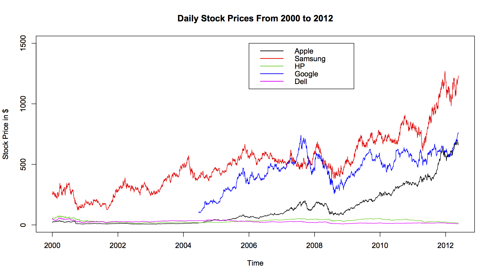

## Prerequisites
- Python 3.3+
- [Tensorflow 0.12.1](https://github.com/tensorflow/tensorflow/tree/r0.12)
- [Zipline](https://github.com/quantopian/zipline)

## Machine learning part

In brief, this a regression problem(supervised learning) in machine learing.

### Input

Raw data is preprocessed as TP Matrix format.

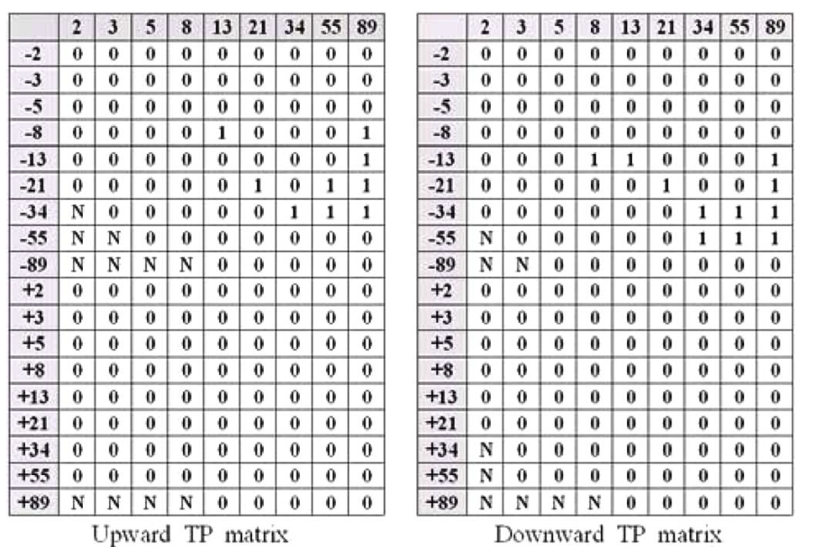
    
### Model

Convolutional Neural Networks is used to fit the labeled data.

### Output

The CNNs gives a predicted stock price change ratio accroding to each input.

## Backtesting part

For one single stock, we train a specific model.  
On the morning of each trading day, we use the model to predict. 
- If the output is large enough(positive), we buy an amount of stock.
- If the ouput is small enough(negative), we sell an amount of stock.
- Otherwise, we just take the "hold" action.

## Results

Three models are trained for three different stocks. The machine learning results and backtesting results are shown below:  

Apple Inc. (AAPL)  

- Machine learning result for both train set and test set; Blue lines stand for ground truth and green stars for predictions.  
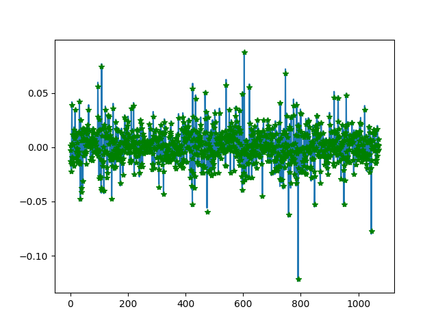
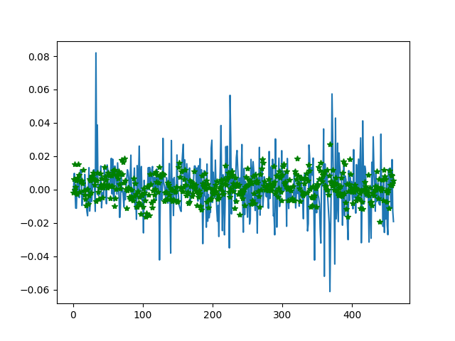

- Backtesting results  
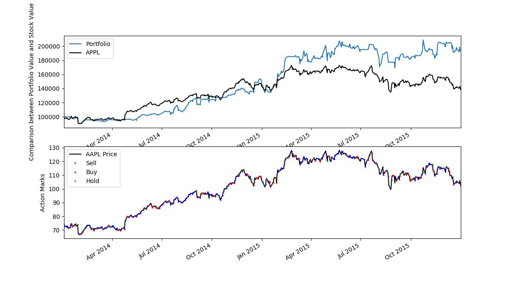

General Electric Company (GE)  

- Machine learning result for both train set and test set.  
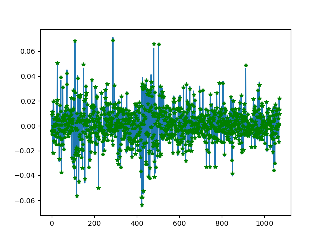
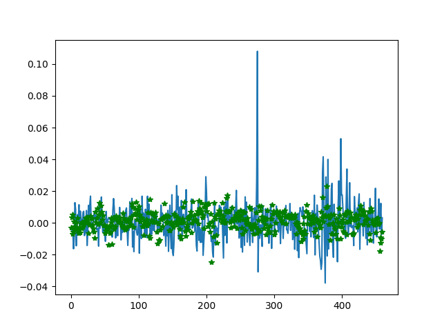

- Backtesting results  
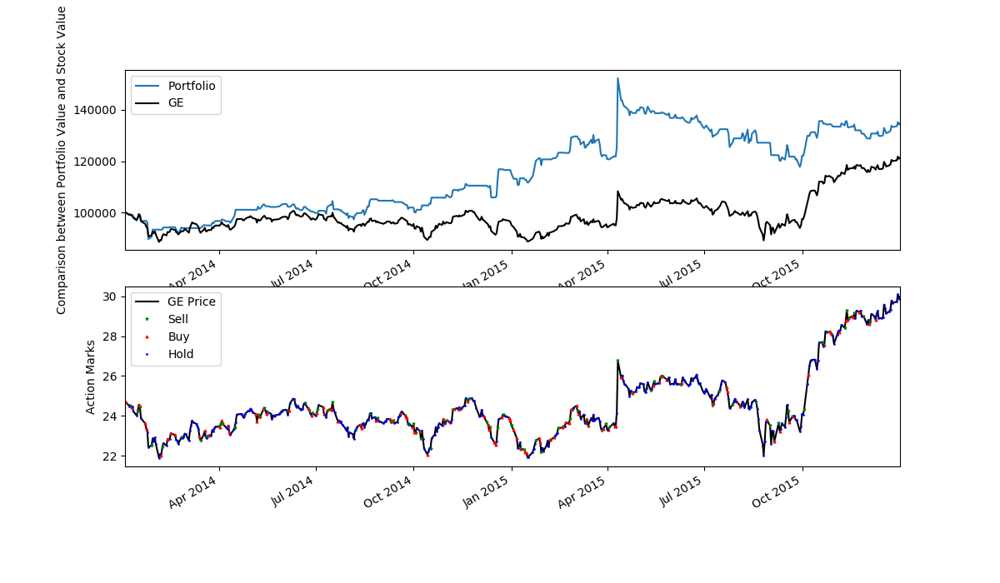

The Boeing Company (BA)  

- Machine learning result for both train set and test set.  
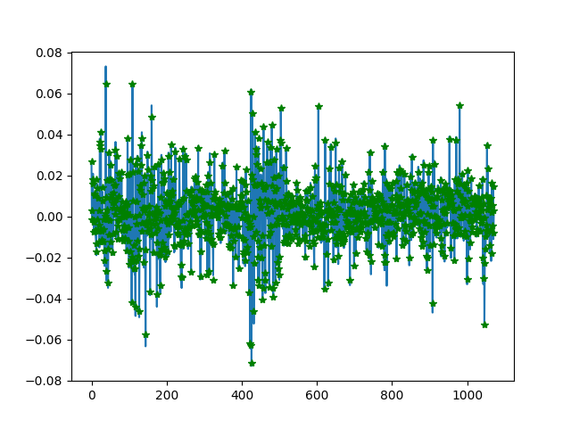
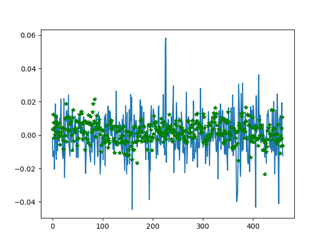

- Backtesting results  
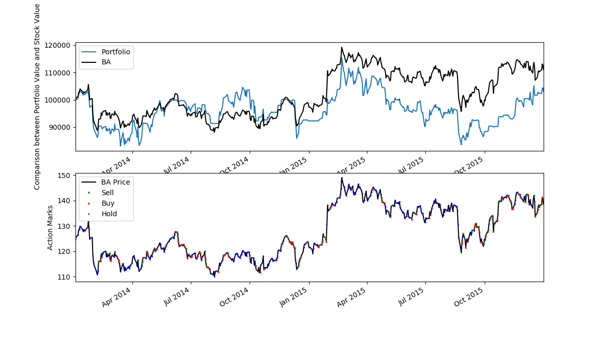

As we can see, backtesting works fine on the first two stocks but doesn't on the third one.

## Future work

Till now, this project is just a demo built for course. And we've listed some needed improvements:

- Try different kinds of inputs
    - Involve more information besides raw stock price
- Use data mining to find the threshold of trading
    - Threshold for buying
    - Threshold for selling
- Keep modifying model parameters
    - The depth of networks
    - The number of neurons of each layers
    - Learning rate
    - ...
- Try more models
    - RNN and LSTM are both good at sovling time series problems.
- Try classification methods on this problem
    - Predict “rise” or “fall” of stock price

## Author

HAN, Siyuan / [@SiYuanHan](https://github.com/SiYuanHan)  
LI, Jianda / [@jiandaLi](https://github.com/jiandaLi)  
HU, Xiaoyu / [@HuXiaoyu1994](https://github.com/HuXiaoyu1994)  
YANG, Austin Liu / [@AustinNeverPee](https://github.com/AustinNeverPee)
